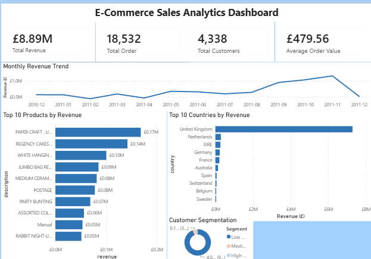

# E-Commerce Sales Analytics

## 📊 Project Overview

An end-to-end E-Commerce Sales Analytics project that analyzes online retail transactions to identify revenue trends, top-performing products, customer behavior, and geographic sales performance.

The project uses **Python, PostgreSQL, SQL, and Power BI** to transform raw transaction data into meaningful business insights.

## 🛠️ Technologies Used

* **Python** — Data cleaning and exploratory data analysis
* **Pandas & NumPy** — Data processing
* **Matplotlib** — Data visualization
* **PostgreSQL** — Database management
* **SQL** — Business analysis and customer segmentation
* **Power BI** — Interactive dashboard and reporting
* **Git & GitHub** — Version control and project management

## 🔄 Project Workflow

Raw Dataset → Python Data Cleaning → PostgreSQL → SQL Analysis → Power BI Dashboard → Business Insights

## 🧹 Data Preparation

The original dataset contained **541,909 transactions**.

Data preparation included:

* Removing duplicate records
* Handling missing values
* Removing cancelled transactions
* Removing invalid prices
* Creating a revenue column
* Loading the cleaned dataset into PostgreSQL

Final cleaned dataset:

**392,692 records**

## 🔎 SQL Analysis

The project includes SQL queries for:

* Total Revenue
* Total Orders
* Total Customers
* Average Order Value
* Monthly Revenue
* Top 10 Products by Revenue
* Top 10 Countries by Revenue
* Top 10 Customers by Revenue
* Customer Segmentation

## 📈 Power BI Dashboard




The dashboard provides an overview of:

* Total Revenue: **£8.89M**
* Total Orders: **18,532**
* Total Customers: **4,338**
* Average Order Value: **£479.56**
* Monthly Revenue Trend
* Top 10 Products by Revenue
* Top 10 Countries by Revenue
* Customer Segmentation

## 💡 Key Business Insights

* The **United Kingdom** generates the majority of revenue.
* Revenue shows significant variation across months, with strong performance during the later months of 2011.
* A small group of high-value customers contributes substantial revenue.
* Product-level analysis identifies the products generating the highest revenue.
* Customer segmentation helps distinguish low-, medium-, and high-value customers.

## 📁 Project Structure

```text
E-Commerce-Sales-Analytics/
│
├── powerbi/
│   └── E-Commerce-Sales-Analytics.pbix
│
├── python/
│   ├── data_cleaning.py
│   ├── eda.py
│   └── visualization.py
│
├── reports/
│   └── charts/
│       ├── monthly_revenue.png
│       ├── top_countries.png
│       ├── top_customers.png
│       └── top_products.png
│
├── sql/
│   └── analysis.sql
│
└── .gitignore
```

## 🎯 Skills Demonstrated

**Python | SQL | PostgreSQL | Power BI | Data Cleaning | EDA | Data Visualization | Customer Segmentation | Business Analytics | Git | GitHub**

## 👩‍💻 Author

**Mayuri Nikhade**

MCA | Aspiring Data Analyst
